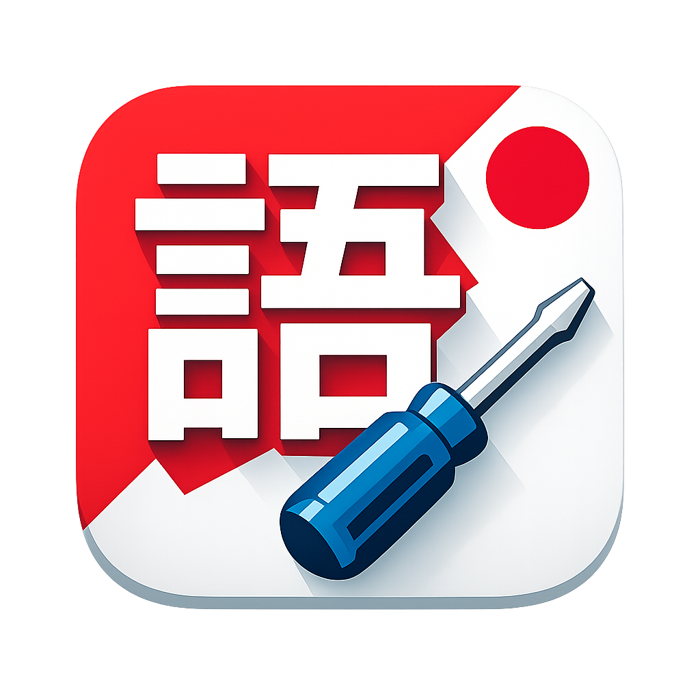

# Nihongo Tools



Desktop-приложение на Kotlin для небольших утилит по изучению японского языка.

Сейчас в приложении доступны:

- подсчет кандзи в документах с экспортом в CSV
- скачивание MP3 из фрагментов словаря Marugoto

## Скачать

Готовые сборки публикуются в `GitHub Releases`.

- Последняя версия: `Releases -> Latest`
- macOS Apple Silicon: `DMG`
- macOS Intel: `DMG`
- Windows x64: `MSI` и `EXE`

После публикации репозитория добавь сюда прямую ссылку:

- [Скачать последнюю версию](../../releases/latest)

## Возможности

### Счетчик кандзи

- принимает документы разных форматов через Apache Tika
- умеет исключать кандзи из отдельного файла
- сохраняет результат в CSV
- поддерживает выбор подпапки для результата
- показывает прогресс обработки

Поддерживаются многие форматы, которые умеет читать Tika, включая `txt`, `pdf`, `docx`, `doc`, `epub`, `fb2` и другие.

### Загрузка аудио Marugoto

- принимает HTML-подобный текстовый фрагмент
- находит пары `_jpn` и `data-audio`
- скачивает `.mp3` с сайта Marugoto
- сохраняет файлы с японскими именами
- поддерживает выбор подпапки для результата
- показывает прогресс скачивания

## Как пользоваться

### Подсчет кандзи

1. Выберите исходный файл.
2. При необходимости выберите файл с исключениями.
3. При желании укажите имя подпапки.
4. Нажмите `Запустить подсчет`.
5. Выберите папку назначения.
6. Получите CSV с колонками `kanji,count`.

Если поле подпапки пустое, CSV сохраняется прямо в выбранную папку.

### Скачивание аудио Marugoto

1. Вставьте HTML-подобный фрагмент.
2. При желании укажите имя подпапки.
3. Нажмите `Скачать MP3`.
4. Выберите папку назначения.
5. Дождитесь завершения загрузки.

Если поле подпапки пустое, аудиофайлы сохраняются прямо в выбранную папку.

## Запуск для разработки

На macOS и Linux:

```bash
./gradlew run
```

На Windows:

```bat
gradlew.bat run
```

## Тесты

```bash
./gradlew test
```
